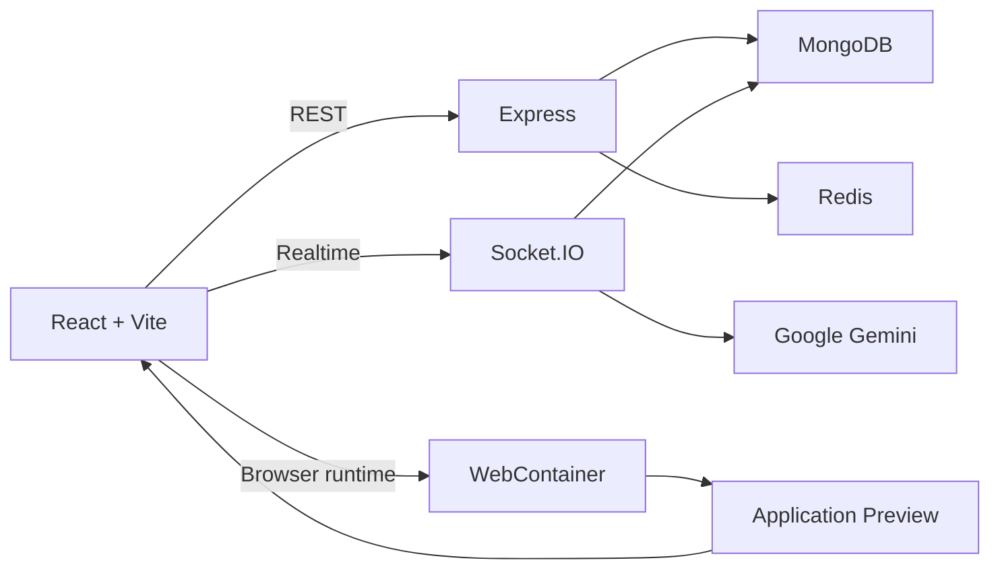

# Jarvis

**Jarvis is a browser-based collaborative coding workspace with integrated AI assistance and in-browser project execution.**

Live application: https://jarvis-spi0.onrender.com/

<p align="center">
  
</p>

## Overview

Jarvis brings collaborative development into a single browser workspace. Authenticated users can create projects, add collaborators, communicate through project-scoped real-time chat, work with a persistent file tree, ask Gemini for coding assistance, and run Node.js projects directly in the browser.

The application is implemented as a single-repository MERN-style system with React on the client and Express, MongoDB, Redis, Socket.IO, Gemini, Monaco Editor, and WebContainers across the application stack.

## Core Capabilities

- User registration and JWT-based authentication
- Project creation and collaborator management
- Project-scoped real-time communication with Socket.IO
- Gemini-assisted coding through `@ai` messages
- Persistent project file trees backed by MongoDB
- Monaco-based code editing
- In-browser Node.js execution with WebContainers
- Integrated project preview
- Docker-based production deployment

## Architecture



### Request and execution flow

```text
Client
  |
  +-- REST --------------------> Express
  |                                |
  |                                +--> MongoDB
  |                                +--> Redis
  |
  +-- Socket.IO ---------------> Project Room
                                   |
                                   +--> Gemini
                                   |
                                   +--> AI response / fileTree
                                            |
                                            v
                                      WebContainer
                                            |
                                      npm install
                                            |
                                       npm start
                                            |
                                            v
                                      Preview iframe
```

The production image builds the Vite frontend and serves the resulting application through Express. REST endpoints and Socket.IO therefore operate from the same origin.

## Technology

| Area | Technology |
| --- | --- |
| Frontend | React 19, Vite 8, React Router |
| Styling | Tailwind CSS, Remix Icon |
| API client | Axios |
| Backend | Node.js, Express 5 |
| Realtime | Socket.IO |
| Database | MongoDB, Mongoose |
| Authentication | JWT, bcrypt, HTTP-only cookies |
| Token revocation | Redis, ioredis |
| AI | Google Gen AI SDK, Gemini 2.5 Flash |
| Editor | Monaco Editor |
| Runtime | WebContainers |
| Deployment | Docker, Node 20 Alpine |
| Hosting | Render |

## Project Structure

```text
Jarvis/
├── backend/
│   ├── app.js
│   ├── server.js
│   ├── db/
│   ├── controllers/
│   ├── middleware/
│   ├── models/
│   ├── routes/
│   └── services/
│
├── frontend/
│   ├── src/
│   │   ├── screens/
│   │   ├── config/
│   │   ├── context/
│   │   ├── auth/
│   │   └── routes/
│   └── vite.config.js
│
├── Dockerfile
├── ARCHITECTURE.md
└── README.md
```

## Authentication

Authentication uses JWTs with bcrypt password hashing.

```text
Register / Login
      |
      v
Validate credentials
      |
      v
Create 24-hour JWT
      |
      +----> HTTP-only cookie
      |
      +----> Bearer token for API / Socket.IO
                    |
                    v
             Protected request
                    |
                    v
             Redis revocation check
                    |
                    v
                JWT verify
                    |
                    v
             Controller / Service
```

On logout, the current JWT is stored in Redis with a 24-hour TTL. The authentication middleware rejects the token while the revocation key exists.

## AI and WebContainer Flow

Messages beginning with `@ai` are processed by Gemini. The AI response may contain a generated `fileTree`.

```text
@ai request
    |
    v
Socket.IO server
    |
    v
Gemini
    |
    v
Response / fileTree
    |
    +--> Persist fileTree in MongoDB
    |
    +--> Mount fileTree in WebContainer
                  |
                  +--> npm install
                  |
                  +--> npm start
                  |
                  v
             server-ready URL
                  |
                  v
                Preview
```

This allows an AI-generated Node.js project to move from a chat request to an executable browser preview without leaving the workspace.

## Data Model

The current MongoDB layer contains two Mongoose models.

```text
User
├── _id
├── email
└── password

Project
├── _id
├── name
├── users[]
└── fileTree
```

`fileTree` is intentionally schema-free and stores WebContainer-compatible project entries.

## API

| Method | Endpoint | Auth | Purpose |
| --- | --- | --- | --- |
| GET | `/health` | No | Health check |
| POST | `/users/register` | No | Register user |
| POST | `/users/login` | No | Authenticate user |
| GET | `/users/profile` | Yes | Return authenticated user |
| GET | `/users/logout` | Yes | Revoke current token |
| GET | `/users/all` | Yes | List users |
| POST | `/projects/create` | Yes | Create project |
| GET | `/projects/all` | Yes | List projects |
| PUT | `/projects/add-user` | Yes | Add collaborators |
| GET | `/projects/get-project/:projectId` | Yes | Fetch project |
| PUT | `/projects/update-file-tree` | Yes | Persist file tree |
| GET | `/ai/get-result?prompt=...` | No | Generate Gemini response |

## Local Development

### Requirements

- Node.js 20+
- npm
- MongoDB
- Redis
- Google AI API key with Gemini access
- Chromium-based browser with WebContainer support

### Installation

```bash
git clone <repository-url>
cd Jarvis
```

Install dependencies:

```bash
cd backend
npm install

cd ../frontend
npm install
```

Create `backend/.env`:

```dotenv
PORT=3000
MONGO_URI=mongodb://127.0.0.1:27017/jarvis
JWT_SECRET=replace-with-a-long-random-secret

REDIS_HOST=127.0.0.1
REDIS_PORT=6379
REDIS_PASSWORD=

GOOGLE_AI_KEY=your-google-ai-api-key

NODE_ENV=development
```

If the frontend and backend run on different origins, create `frontend/.env`:

```dotenv
VITE_API_URL=http://localhost:3000
```

Start the backend:

```bash
cd backend
node server.js
```

Start the frontend in another terminal:

```bash
cd frontend
npm run dev
```

The development frontend normally runs at `http://localhost:5173`.

## Docker

Jarvis uses a two-stage Docker build.

```bash
docker build -t jarvis .
docker run --rm -p 3000:3000 --env-file backend/.env jarvis
```

The first stage builds the Vite frontend. The second stage runs the Express and Socket.IO server and serves the generated frontend from `backend/public`.

MongoDB and Redis are external services and must be configured separately.

## Frontend Commands

```bash
npm run dev
npm run build
npm run preview
npm run lint
```

The backend currently runs directly with:

```bash
node server.js
```

## Deployment

The production deployment uses Docker with Node 20 Alpine. The container serves:

- The React single-page application
- REST APIs
- Socket.IO

The deployed application is available at:

https://jarvis-spi0.onrender.com/

WebContainer requires cross-origin isolation. Jarvis configures the required `Cross-Origin-Opener-Policy` and `Cross-Origin-Embedder-Policy` headers in development and production.
